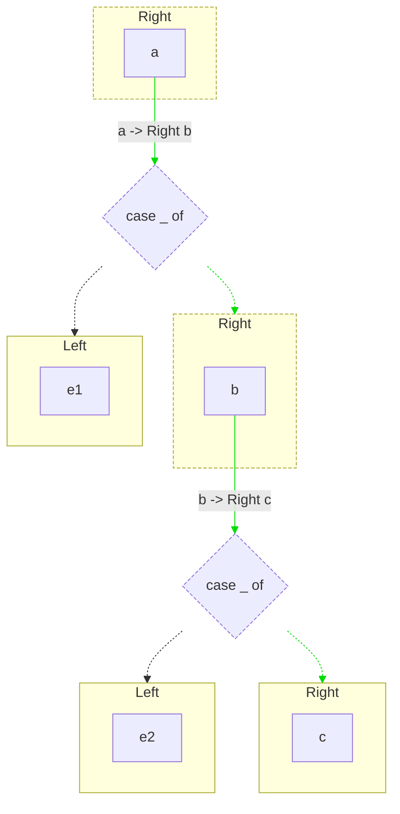

```mermaid
flowchart TD;
  subgraph right_a [Right]
    a
  end
  subgraph right_b [Right]
    b
  end
  subgraph right_c [Right]
    c
  end
  subgraph left_e1 [Left]
    e1
  end
  subgraph left_e2 [Left]
    e2
  end
  a --> |"a -> Right b"| case1{case _ of}
  b --> |"b -> Right c"| case2{case _ of}
  case1 -.-> right_b
  case1 -.-> left_e1
  case2 -.-> left_e2
  case2 -.-> right_c

  linkStyle 0 stroke:#0d0
  linkStyle 1 stroke:#0d0
  linkStyle 2 stroke:#0d0
  linkStyle 5 stroke:#0d0
  classDef boilerplate stroke-dasharray: 4 2
  class right_a boilerplate;
  class right_b boilerplate;
  class case1 boilerplate
  class case2 boilerplate
```