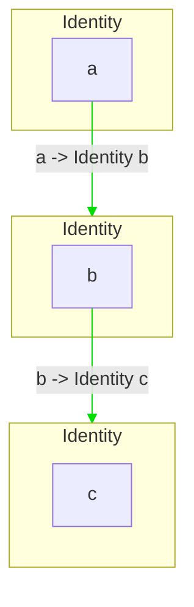

```mermaid
flowchart TD;
  subgraph identity_a [Identity]
    a
  end
  subgraph identity_b [Identity]
    b
  end
  subgraph identity_c [Identity]
    c
  end
  a --> | a -> Identity b | identity_b
  b --> | b -> Identity c | identity_c

  linkStyle 0 stroke:#0d0
  linkStyle 1 stroke:#0d0
```