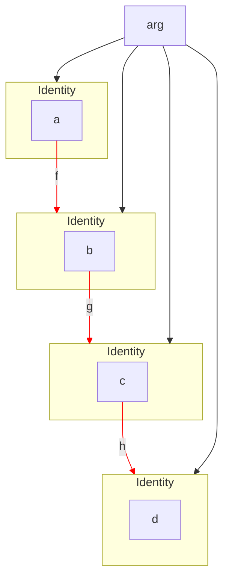

```mermaid
flowchart TD;
  arg
  subgraph identity1 [Identity]
    a
  end
  subgraph identity2 [Identity]
    b
  end
  subgraph identity3 [Identity]
    c
  end
  subgraph identity4 [Identity]
    d
  end

  arg --> identity1
  a -->|f| identity2
  arg --> identity2
  b -->|g| identity3
  arg --> identity3
  c -->|h| identity4
  arg --> identity4


  linkStyle 1 stroke:#f00
  linkStyle 3 stroke:#f00
  linkStyle 5 stroke:#f00
```