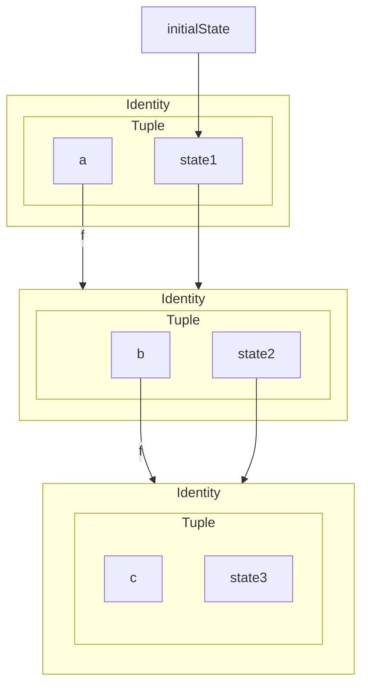

```mermaid
flowchart TD;
  initialState
  subgraph identity1 [Identity]
    direction LR
    subgraph tuple1 [Tuple]
      a
      state1
    end
  end
  subgraph identity2 [Identity]
    direction LR
    subgraph tuple2 [Tuple]
      b
      state2
    end
  end
  subgraph identity3 [Identity]
    direction LR
    subgraph tuple3 [Tuple]
      c
      state3
    end
  end

  initialState --> state1
  a -->|f| identity2
  state1 --> identity2
  b -->|f| identity3
  state2 --> identity3


  %%linkStyle 0 stroke:#f00
  %%linkStyle 1 stroke:#f00
```